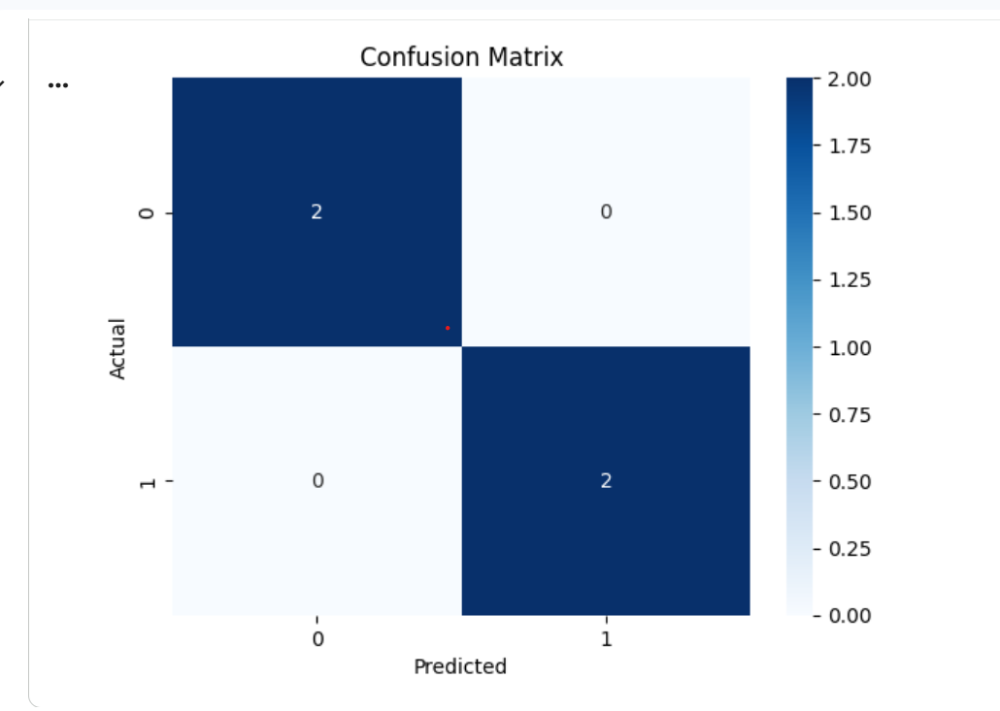

# Classification Using Logistic Regression

## 📌 Project Overview

This project is a beginner-friendly Machine Learning Classification project using **Logistic Regression**.

The model classifies patients into two categories:

- **Healthy (0)**
- **Sick (1)**

The project demonstrates the basic workflow of classification, including data preparation, model training, prediction, and model evaluation.

## 🎯 Objective

The objective of this project is to build a classification model that can predict whether a patient is **Sick or Healthy** based on health-related features.

## 📊 Dataset

The dataset contains patient health information.

### Features Used

- Age
- Blood Pressure
- Cholesterol

### Target Variable

- `0` = Healthy
- `1` = Sick

## 🛠️ Technologies Used

- Python
- Pandas
- Matplotlib
- Seaborn
- Scikit-learn
- Google Colab

## 🔄 Project Workflow

1. Imported the required Python libraries
2. Created and explored the dataset
3. Checked for missing values
4. Separated features and target variable
5. Split the dataset into training and testing data
6. Created a Logistic Regression model
7. Trained the model
8. Made predictions on the test data
9. Evaluated the model using accuracy
10. Generated a classification report
11. Created a confusion matrix
12. Tested the model with a new patient

## 🤖 Machine Learning Model

### Logistic Regression

Logistic Regression was used to perform binary classification.

The model predicts whether a patient belongs to the **Healthy** or **Sick** category.

## 📈 Model Evaluation

The model was evaluated using:

- Accuracy Score
- Classification Report
- Confusion Matrix

### Accuracy

The model achieved **100% accuracy on the test data**.

> Note: The dataset used in this beginner project is small, so this accuracy should not be considered representative of real-world medical performance.

## 📊 Confusion Matrix

The confusion matrix shows the actual and predicted classifications.

The model correctly classified all 4 test samples, with no incorrect predictions.

## 🔮 New Patient Prediction

The trained model was also used to predict the health category of a new patient based on:

- Age
- Blood Pressure
- Cholesterol

## 📚 Key Learning

Through this project, I learned the basic concepts of:

- Machine Learning Classification
- Logistic Regression
- Train-Test Split
- Model Training
- Prediction
- Accuracy Evaluation
- Confusion Matrix
- Classification Report

## 👩‍💻 Author

**Alisha Noor**

Software Engineering Student | Aspiring Data Analyst
